# Obligatorio de Seguridad en Redes de Datos - ORT

## **Fecha de entrega 03/12/2025  -  21Hs**

**Profesor:** Mauricio Campiglia  
**Estudiantes:** Federico Morra (143394) – Pablo Rizzo (181374)

## 1. Descripción general

Este repositorio contempla todos los requerimientos, configuraciones básicas y limitaciones a tener presente para
la implementacion de una infraestructura de red segura para una empresa local que ha decidido migrar parte de su
infraestructura on-premise hacia la cloud. El foco del proyecto sera siempre la seguridad de la red y el correcto
uso y gestion de las identidades de usuarios de la misma, siendo hoy en dia el principal vector de un ataque cibernetico.

Nosotros asumimos que los temas que no son requeridos por el cliente en este proyecto, estan saneados y correctamente configurados,
dado que si alguna otra capa o control de seguridad ajeno a este proyecto, falla, la infraestructura de red sugerida
se vera vulnerada con consecuencias directas sobre la continuidad del negocio de la empresa Fosil S.A..

---

## 2. Presentación del problema por parte del cliente

Fósil Energías Renovables S.A.(fosil.uy) es una empresa uruguaya del sector energético con más de cinco
décadas de trayectoria. Su origen se remonta a la década de 1970, cuando fue fundada bajo el nombre Fósil
S.A., dedicada a la importación, almacenamiento y distribución de hidrocarburos en el mercado nacional.
Durante varias décadas fue un actor relevante en la cadena de suministro de combustibles fósiles, atendiendo
tanto a clientes industriales como residenciales.

En el año 2015, en el marco de la transición energética global y los compromisos del Uruguay en materia de
energías limpias, la compañía adoptó un nuevo modelo de negocio y un cambio de identidad corporativa,
pasando a denominarse Fósil Energías Renovables. Este rebranding no fue solo simbólico: implicó una fuerte
inversión en la diversificación de su matriz energética, incorporando proyectos de generación a partir de fuentes
solares y eólicas.

Hoy en día, la empresa combina la gestión de infraestructuras tradicionales—oleoductos, plantas de
almacenamiento y distribución de combustibles con parques solares y aerogeneradores ubicados
principalmente en el interior del país. Esta dualidad convierte a Fósil Energías Renovables en un actor híbrido,
con el desafío de mantener la operación crítica de sus sistemas legados mientras impulsa soluciones innovadoras
en el ámbito de la energía sustentable.

Con una plantilla aproximada de 500 colaboradores, la organización cuenta con un centro de datos en
Montevideo para sus sistemas de gestión, así como plataformas en la nube orientadas a clientes corporativos y
usuarios residenciales. Además, opera soluciones de telemetría e IoT para el control de la generación renovable,
consolidando su papel como un actor estratégico en el proceso de transformación energética del país.

Alcance:

Su equipo es el responsable de la implementación de los controles de seguridad que se detallan en este alcance.

1. Redes Privadas Virtuales (VPN)

   - Deberá implementar la interconexión entre el centro de datos de Montevideo y la infraestructura
      en nube. Para esta solución no será necesario tener en cuenta la redundancia.
   - Deberá también implementar acceso administrativo seguro para los administradores de red y
      sistemas (usuarios privilegiados).

      - La protección de este canal de acceso deberá tener en cuenta los desafíos y riesgos
         actuales de autenticación e identidad digital.
      - Se espera que esta solución permita asignar políticas granulares de acceso
         dependiendo de la identidad de quien se conecte.

2. Protección de Aplicaciones Web (WAF y API Gateway)

   - Deberá implementar una solución de API Gateway que permita proteger la infraestructura de
      soporte de telemetría y aplicaciones.
   - Deberá configurar una solución WAF que pueda detectar y detener los ataques comunes del
      OWASP Top Ten en tiempo real sin afectar la funcionalidad del portal web.

      - Se espera que esta solución se integre con el SIEM
      - Se le pide que configure al menos dos reglas personalizadas

3. Monitoreo y Respuesta (SIEM)

   - Deberá desplegar un SIEM para monitoreo, detección y respuesta.

      - Deberá integrarse con el resto de la maqueta, recibiendo alertas de las soluciones de
         WAF, VPN y la plantilla GNU/Linux endurecida.
      - Deberá configurar 3 casos de uso personalizados, al menos uno de ellos relacionado
         con autenticación.

4. Gestión de Identidad y Accesos (IAM)

   - Deberá implementar o configurar un proveedor de identidad centralizado para los usuarios de la
      organización (interno).

      - Deberá poder proveer un punto de autenticación y autorización utilizando protocolos
         estándares (OAuth2 u OpenIDC).
      - Deberá poder integrarse o soportar analítica de comportamiento de usuarios para
         detectar patrones de uso (autenticación) anómalos.

5. Plantilla de Servidor endurecida

   - Deberá proponer una forma de estandarizar el proceso de endurecimiento del sistema operativo
      GNU/Linux utilizado como base para el despliegue de la infraestructura de la organización.

      - Deberá tomar como referencia los CIS CSC Benchmark L1.
      - El entregable deberá poder replicarse con cada despliegue de servidor. Se espera que
         entregue los scripts asociados, no una plantilla o imagen.
      - Como mínimo, el endurecimiento deberá contemplar:

         1. Firewall local
         2. Auditoría del sistema
         3. Acceso administrativo seguro
         4. Integración con el SIEM

---

## 3. Análisis y propuesta de la solucion

Aca faltan aclarar varios temas.......

**Como resumen tecnico la solución propuesta provee:**

- Un servidor ubicado en el borde entre las zonas DMZ e Internet que cumplira funciones de Firewall (PFsense con OpenVPN)
- Un servidor en la zona DMZ que cumplira funciones de WAF (Apache ModSecurity)
- Un servidor en la zona DMZ que cumplira funciones de  API Gateway (Kong API Gateway)
- Un servidor en la zona SERVIDORES que cumplira funciones de web server (Apache)
- Un servidor en la zona SERVIDORES que cumplira funciones de SIEM (Wazuh)
- Un servidor en la zona SERVIDORES que cumplira funciones de autenticacion (FreeIPA + Keycloak)
- La solución del Firewall se montará en un servidor con sistema operativo FreeBSD, en los demas servidores se usará la distribución Debian 12.

A los efectos practicos de demostrar el funcionamiento de todos estos servicios, y cumpliendo con los requerimientos de letra,
la maqueta presentada seran 4 VMs que agruparan varios servicios, pero que claramente en un ambiente de produccion no podrian
compartir hardware ni direccionamiento IP. Aquellas VMs que solo demostraran una funcion especifica que no sea el endurecimiento del sistema operativo, tendran un sistema operativo Linux Rocky 9.6, en cambio la VM a la cual se le aplicara la politica de hardening tendra un sistema operativo Linux Debian 12.

---

## 4. Redes Privadas Virtuales (VPN)

*Guia detallada de configuracion de un firewall PFsense con el servicio de OpenVPN*

Para la implementacion de un acceso seguro a la empresa, por parte de los colaboradores que acceden a traves de internet, hemos optado por un firewall PFsense (version 2.8) el cual ya tiene incluido de fabrica el paquete OpenVPN y el modulo OpenVPN-client-export que nos permitira exportar facilmente las politicas VPN desde el firewall PFsense para instalarla en los clientes VPN de los laptops de los colaboradores remotos. El paquete OpenVPN nos permitira configurar una VPN Client-Access para dichos colaboradores y como segundo factor de autenticacion hemos optado por un certificado que se instalara en el dispositivo remoto de cada usuario que la vaya a utilizar y un codigo OTP que se generara automaticamente en los celulares de los colaboradores mediante el uso de una app del tipo Google Authenticator.

En el firewall se crearan 2 perfiles client-access de VPN, uno de ellos para los Administradores de TI a los cuales se les asignara una direccion IP del pool 10.0.1.0/24 y el otro perfil sera para los usuarios basicos, a los cuales se les asignara una direccion IP del pool 10.0.2.0/24. Con esto permitiremos el acceso administrativo granular a distintos recursos de la red utilizando reglas de firewall que filtraran el acceso dependiendo de la direccion IP de origen. Por ejemplo cuando el perfil que se establezca sea el de los Administradores (IPs 10.0.1.0/24) hay una regla en el firewall que les permite acceder a la red 192.169.2.0/24 unicamente y en caso de ser un perfil de Usuario basico (IPs 10.0.2.0/24), hay otra regla que solo les permite acceder a la red 192.168.3.0/24. Cabe destacar que estas reglas se pueden customizar aun mas dependiendo de los requerimientos de acceso a los ecursos por parte de los colaboradores

A los efectos practicos, autogeneramos un certificado local, el cual no tiene validez en internet, pero si servira para establecer las VPNs Client-access requeridos por la organizacion. Al momento de llevarlo al ambiente de produccion, la empresa Fosil debera costear dicho certificado con una CA reconocida. Para la implementacion de la VPN IPsec site-to-site, hemos optado por utilizar Pre Shared Key aunque puede utilizarse certificados para mayor seguridad de la VPN.

Para cumplir los requisitos de gestion de usuarios segura y centralizada, decidimos implementar un servidor FreeIPA que sera alojado en la red interna de servidores, y su proposito sera autenticar a todos aquellos colaboradores que intenten ingresar mediante VPN. Para ello, en el firewall PFsense central, vinculamos como servidor de autenticacion al servidor interno FreeIPA utilizando el protocolo LDAP como protocolo de autenticacion entre ambos equipos, pudiendo mejorarse dicha comunicacion si se implemente LDAPS que es mas seguro que LDAP. Cuando el firewall PFsense Central permite validar las autenticaciones VPN de los colaboradores con el FreeIPA, la base local de usuarios y contrasenas del PFsense queda deshabilitada en la configuracion del servidor OpenVPN y esto asegura un control centralizado de las cuentas de usuarios ya sea de la VPN como de los dispositivos de red.

En la topologia de red sugerida existiran 2 tipos de conexiones VPN, una de ellas sera del tipo Client-Access para los colaboradores remotos que necesitan utilizar servicios internos de la empresa, y el segundo tipo de VPN sera site-to-site y sera para unir el sitio central en Montevideo, con los nuevos servicios que la empresa desea levantar en la Cloud de AWS. A continuacion detallaremos la configuracion de ambos tipos de VPNs, la primera de ellas, Client-access, que se demostrara con un laptop (Con el cliente OpenVPN) y un firewall PFsense, y el segundo tipo de VPN, site-to-site se demostrara utilizando dos firewalls PFsense enlazados por sus interfaces WAN y arriba de ellas correra el tunel IPsec correspondiente.

**Configuracion del servidor OpenVPN en el firewall PFsense central**

A continuacion se observa como quedan configurados los 2 perfiles de acceso tipo Client-access para los usuarios basicos y para los administradores de TI. Mas abajo detallamos paso a paso como crear cada perfil y que parametros varian en cada perfil.

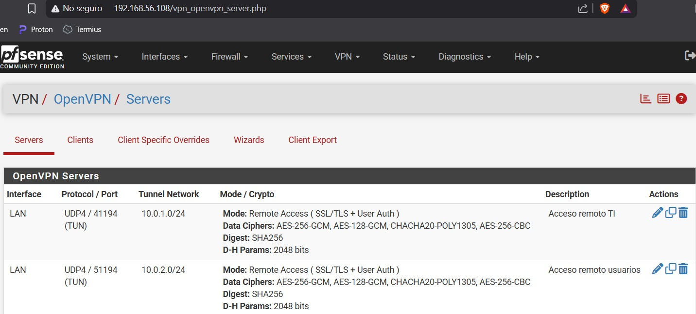

A continuacion se puede ver mas en detalle como los clientes VPN se autenticaran contra el servidor FreeIPA y no la local database. Tambien seleccionamos la interface (wan) por donde llegaran los intentos de conexion VPN y el puerto que escuchara el servidor Open VPN decidimos cambiarlo a 41194 en el caso del perfil de administradores de TI y 51194 para el perfil de los usuarios basicos, para no dejarlo en el valor por defecto de OpenVPN que es el puerto 1194.

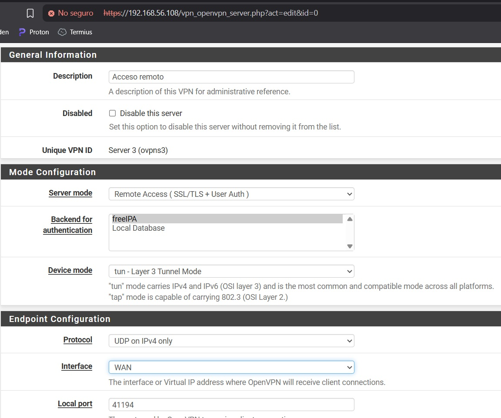

Se habilita la casilla TLS para el uso del certificado (autofirmado por el propio PFsense) al cual le llamamos fosil. Esto es requisito indispensable de seguridad para el acceso seguro de nuestros colaboradores indistintamente del perfil de VPN que tenga cada uno.

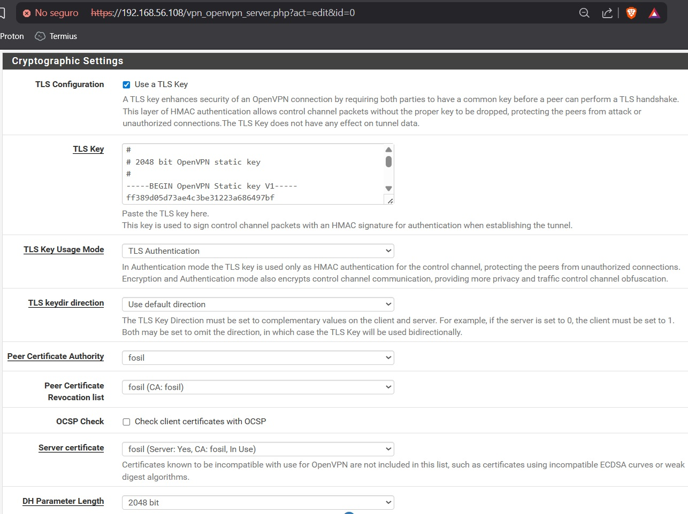

Y finalmente se configuran las redes remotas y del tunel VPN en si mismo. Aqui es donde vamos a aplicar el control de acceso granular para cada perfil, es decir, para el perfil de Administradores de TI, el tunel IP tendra una direccion IP del Pool 10.0.1.0/24 y para el caso de los usuarios basicos, el tunel IP tendra una direccion IP del Pool 10.0.2.0/24.

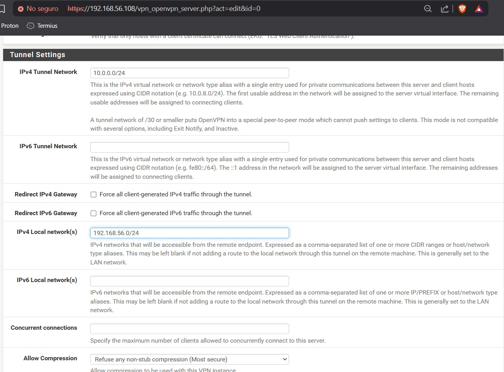

Luego se crea el servidor FreeIPA el token OTP para los cada usuario que se vaya a loguear a traves de la VPN, y el mismo puede ser valido por el tiempo que las politicas de la empresa requieran.

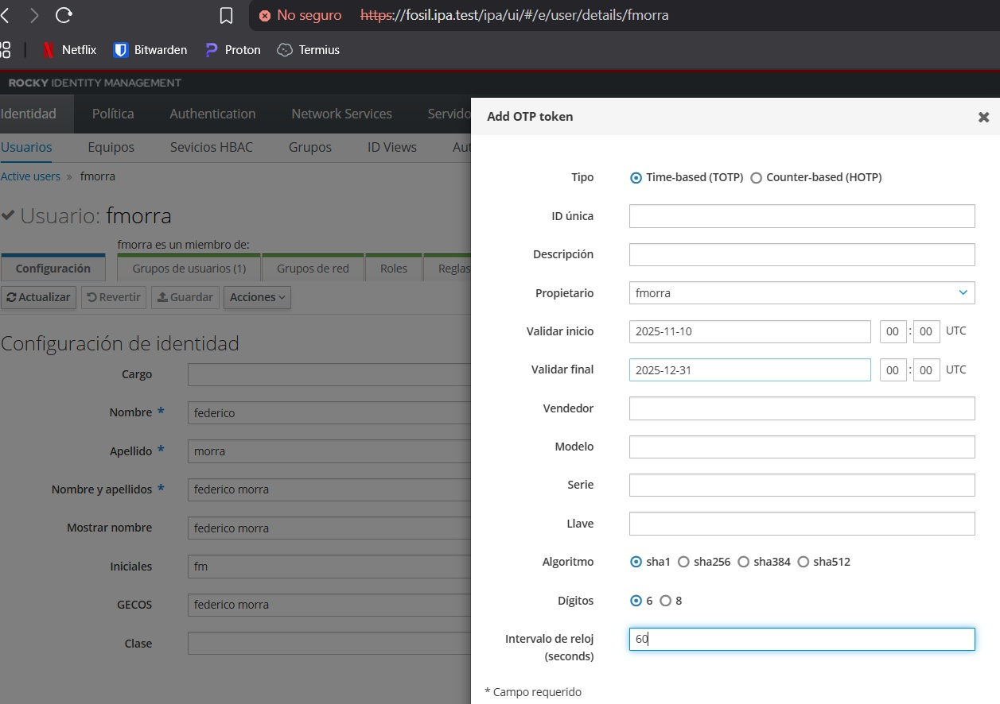

Una vez creado el token OTP, debemos habilitarlo en las opciones de inicio de sesion del usuario dado, si solo configuramos la opcion OTP, y el usuario no tiene consigo el dispositivo generador de OTP, el colaborador no podra loguearse por VPN, requisito fundamental de seguridad de la empresa Fosil.

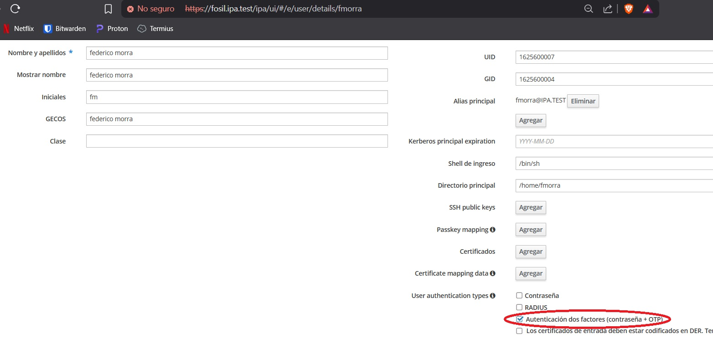

Una vez finalizada la etapa de generacion de generacion de los perfiles OpenVPN y la autenticacion con 2FA, debemos aplicarle las reglas de acceso granular a los distintos perfiles VPN para que solo puedan acceder a los recursos especificos que correspondan. Esta configuracion de reglas entrantes se realiza en el firewall PFsense central donde tenemos definidos los perfiles de OpenVPN

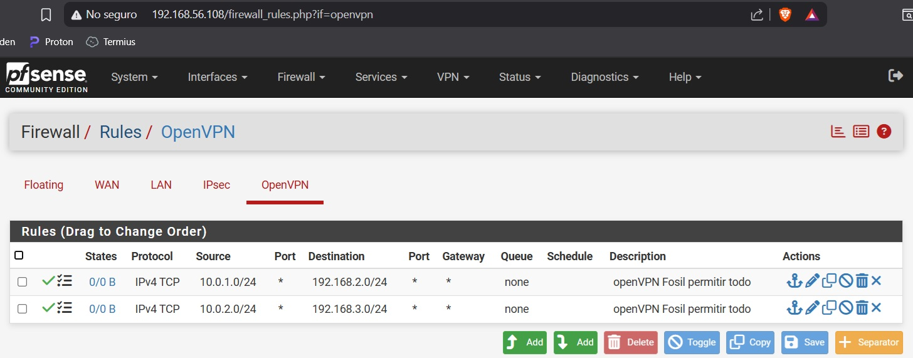

Una vez finalizada toda la configuracion VPN en el firewall PFsense, debemos exportar las politicas/perfiles VPN para cada colaborador, sabiendo que en este caso tenemos 2 perfiles definidos, el de Administradores IT y el de usuarios basicos.

Aqui se pueden descargar ambos perfiles de OpenVPN configurados y exportados del PFsense [perfil_TI.ovpn](vpn/perfil_TI.ovpn) y [perfil_basico.ovpn](vpn/perfil_basico.ovpn)

A continuacion se muestra como podrian quedar cargados ambos perfiles en un mismo PC a los efectos de ver la diferencia de nomenclatura de los perfiles, pero en la practica, ningun colaborador tendra ambos perfiles instalados en el mismo PC remoto.

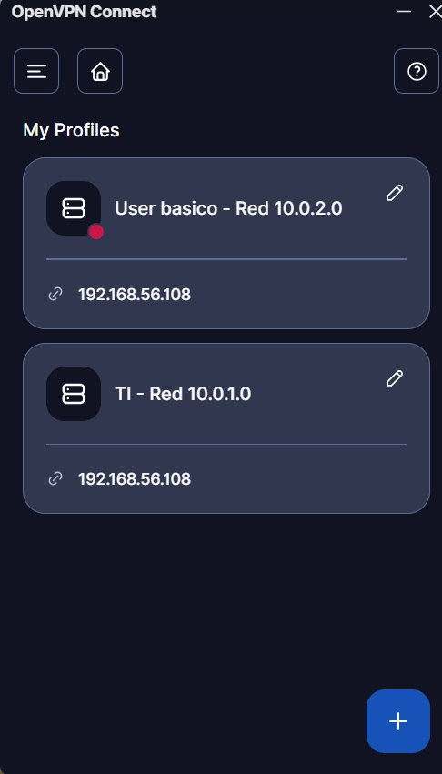

Hasta aqui hemos configurado la VPN client-access para acceso de los colaboradores remotos a la redes internas de la empresa. A continuacion detallaremos la configuracion paso a paso entre los dos firewalls PFsense que levantaran una VPN site-to-site entre las oficinas centrales de Montevideo (PFsense Central utilizado para los accesos client-acces) y la nube de AWS (PFsense Cloud AWS). Como mencionamos anteriormente ambos firewalls estaran enlazados fisicamente por sus interfaces WAN con direccionamiento 172.16.16.0/24 simulando ser una red publica como los es internet, y las redes locales de seran la 192.168.56.0/24 y 192.168.2.0/24 para el PFsense Central y para el PFsense Cloud respectivamente.

A continuacion configuramos el tunel IPsec en cada firewall PFsense, primero la fase 1 y luego la fase 2. Cabe aclarar que en ambos extremos del tunel los parametros de seguridad de la VPN tales como la PSK, algoritmos de encriptacion, entre otros, son identicos dado que de lo contrario el tunel IPsec no se establece en ninguna de las fases. La PreSharedKey de las capturas es una sugerencia de nuestro grupo que debe ser modificada si estas configuraciones se ponen en produccion en la empresa Fosil dado que es un parametro critico.

Configuracion en el firewall Central:

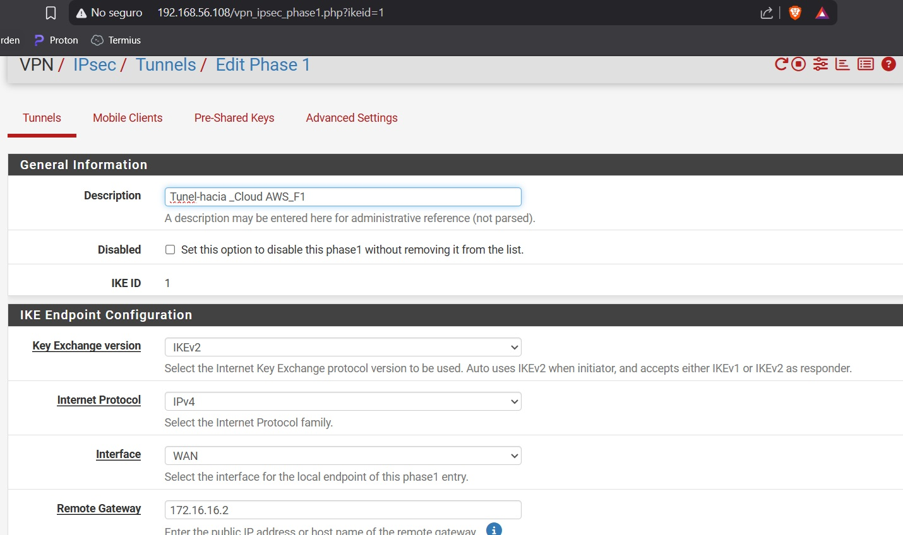

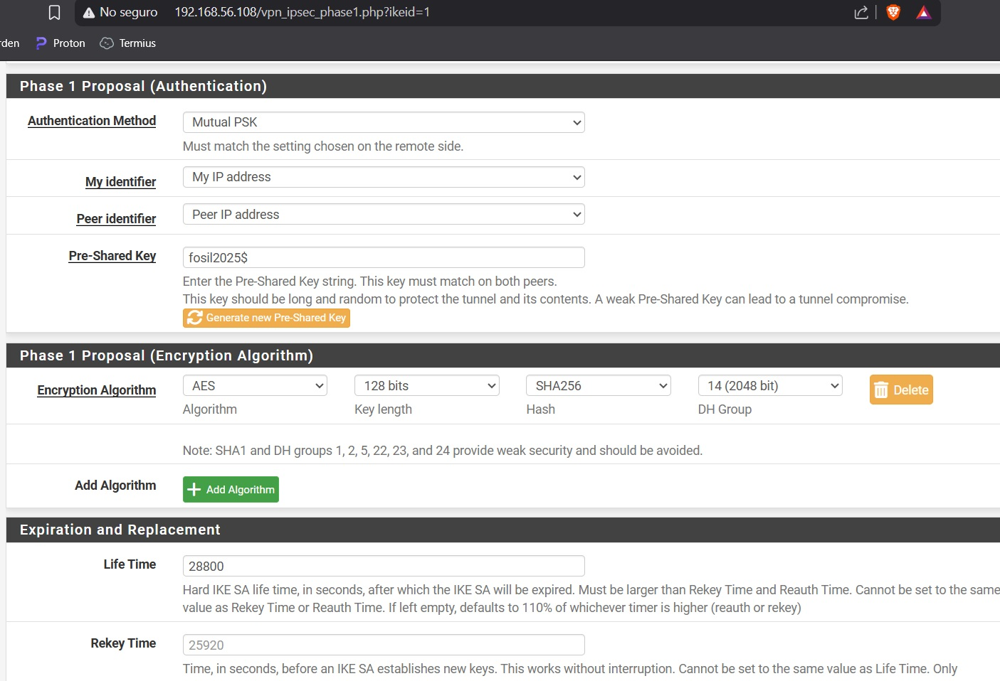

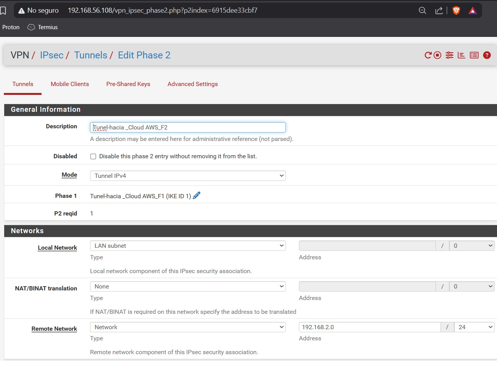

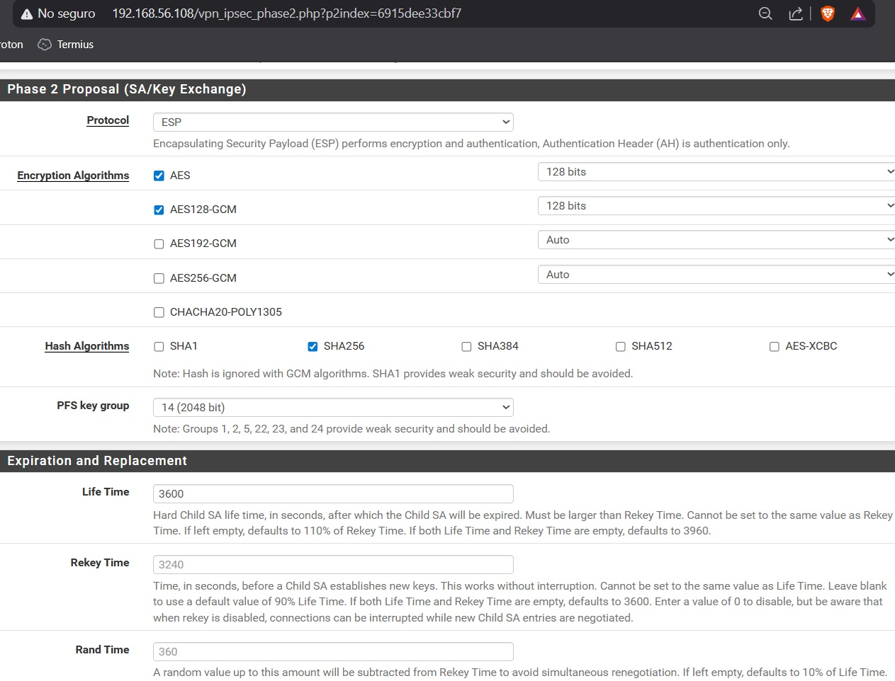

Podemos verificar que ambas fases del tunel quedaron configuradas en la seccion VPN/IPsec del PFsense Central

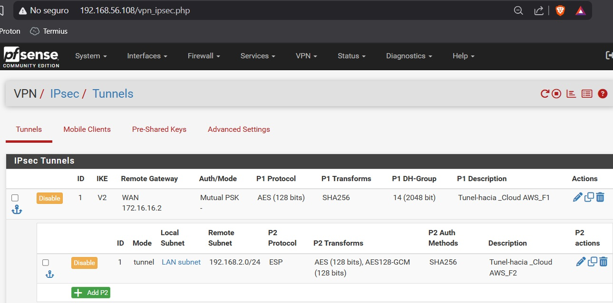

Configuracion en el firewall Cloud:

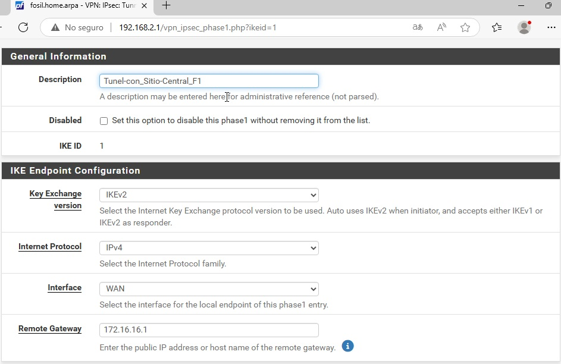

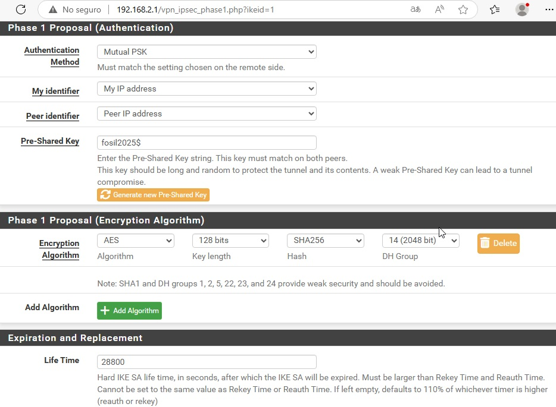

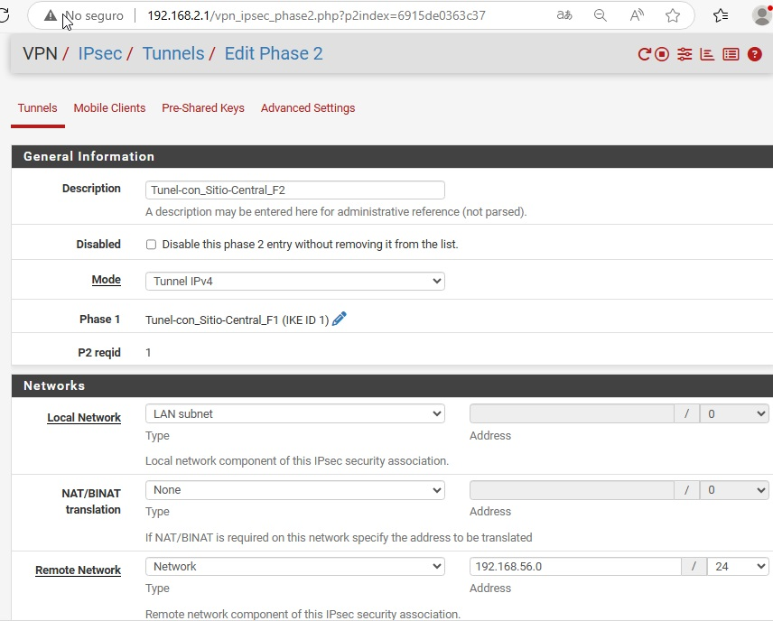

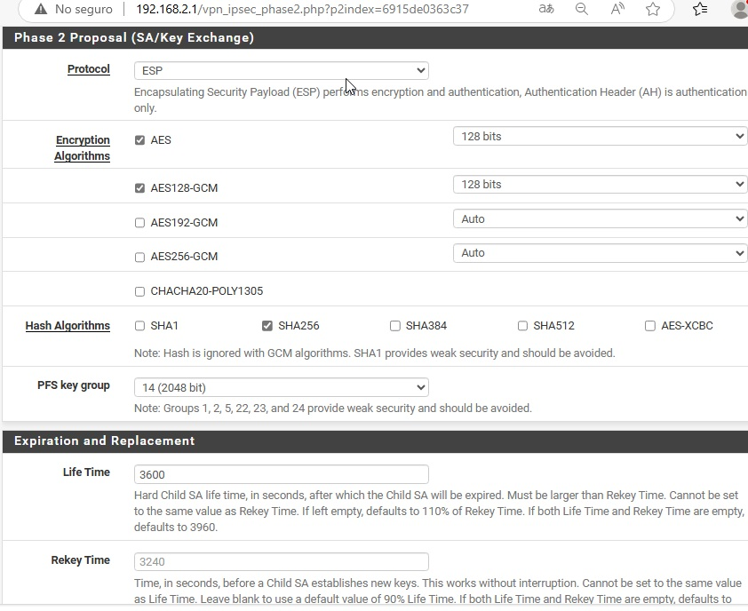

Podemos verificar que ambas fases del tunel quedaron configuradas en la seccion VPN/IPsec del PFsense Cloud

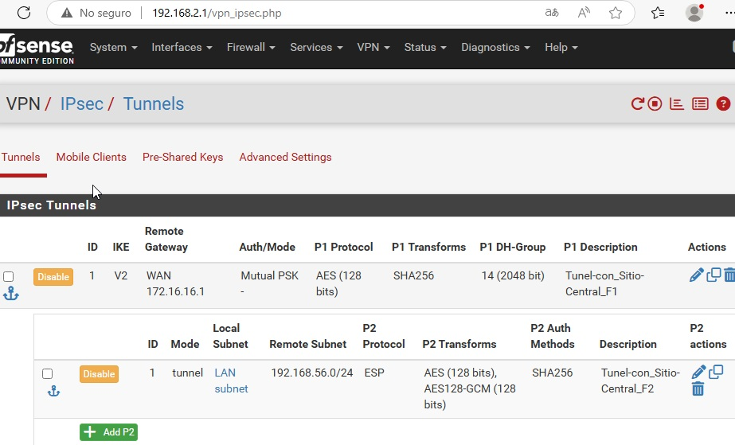

Luego de haber configurado ambas fases del tunel IPsec en cada firewall, se configuran las reglas que permitiran el trafico entrante y saliente en el firewall PFsense Central (192.168.56.108)

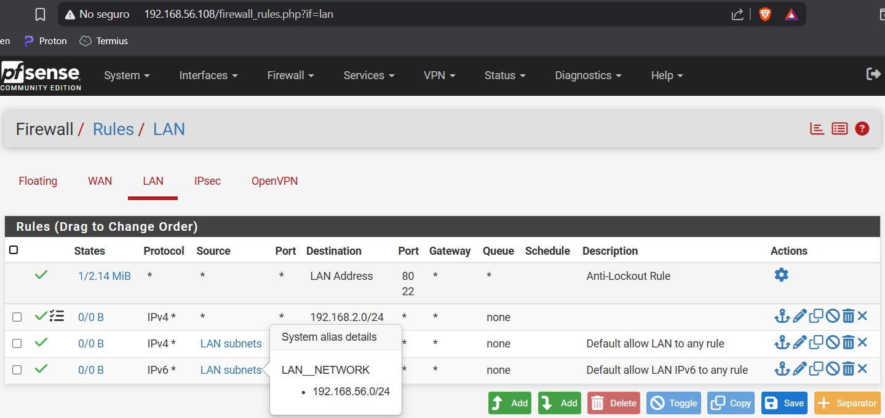


De forma analoga se configuran las reglas entrantes y saliente en el firewall PFsense Cloud (192;168.2.1) pero con el direccionamiento correspondiente.

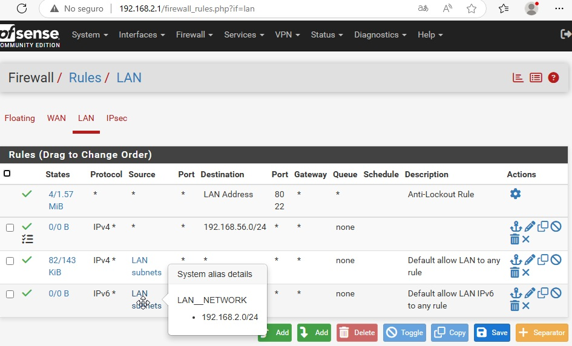

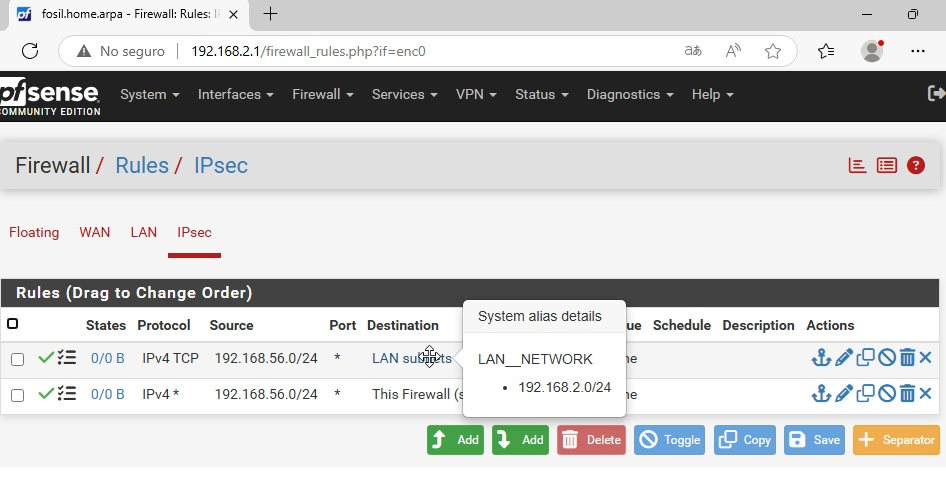

En este punto quedan finalizadas las configuraciones de ambos tipos de VPN, dejando las capturas que evidencian el correcto funcionamiento en la seccion #12 Capturas de funcionamiento de la maqueta virtual.

---

## 5. Proteccion de Aplicaciones Web (WAF y API Gateway)

*Guia detallada de configuracion de ambos servicios (y su integracion con el SIEM)*

Antes de la implementacion de estos componentes, se instala el servidor web con Apache mod_security en modo reverse proxy.

Se configura el siguiente VirtualHost:

```bash
sudo nano /etc/apache2/sites-available/wp.example.com.conf
```

<VirtualHost *:80>
ServerName wp.example.com

    ProxyPreserveHost On
    
    ProxyPass        / http://127.0.0.1:8080/
    ProxyPassReverse / http://127.0.0.1:8080/
    
    ErrorLog ${APACHE_LOG_DIR}/wp.example.com-error.log
    CustomLog ${APACHE_LOG_DIR}/wp.example.com-access.log combined

</VirtualHost>

```bash
# Activar el sitio y recargar apache2
a2ensite wp.example.com.conf
systemctl reload apache2
```

Para resolver el nombre se optará por agregar la entrada en el /etc/hosts

### 5.A Instalación de la solucion de WAF

La instalacion de Mod Security se automatizó mediante el siguiente script: [Instalacion Solución WAF](waf/install.sh)

#### 5.A.A Reglas personalizadas: configuración

```bash
# Crear directorio de reglas 
sudo mkdir /etc/modsecurity/local_rules

# Generar archivo de configuracion y agregar:
sudo nano /etc/modsecurity/local_rules/custom_rules.conf

# Regla custom 1: Bloquear agentes de usuario comunes de herramientas de escaneo
SecRule REQUEST_HEADERS:User-Agent "(?i:(curl|nikto|sqlmap|fimap|nessus|nmap|acunetix|wpscan|arachni|dirbuster|burpsuite))" \
    "id:100010,\
    phase:1,\
    deny,\
    log,\
    msg:'User-Agent sospechoso detectado (posible escaneo o fuzzing)'"

# Regla custom 2: Protección de rutas críticas o administrativas
# Bloquear acceso a rutas administrativas desde IPs no internas
SecRule REQUEST_URI "@rx ^/(admin|dashboard|internal|controlpanel)" \
    "id:100020,\
    phase:1,\
    deny,\
    log,\
    msg:'Acceso no autorizado a ruta administrativa'"


# Inculuir las reglas en la configuracion activa
sudo nano /etc/modsecurity/modsecurity.conf

# Agregar al final:
#Incluir reglas personalizadas (luego de las reglas Owasp CRS)
#asi las reglas se cargan despues y no sobreescriben comportamientos
IncludeOptional /etc/modsecurity/local_rules/*.conf

# Reiniciar servicio de apache
sudo systemctl reload apache2

# Verificar que no esté con errores
sudo systemctl status apache2

# Pruebas de funcionamiento de la regla
curl -I http://localhost/test

# Se deberia de obtener un HTTP 403 Forbidden y ver el log de ModSecurity
# El mensaje: "Acceso bloqueado a /test por regla personalizada"
```

#### 5.A.B Pruebas de ataques WEB para deteccion y bloqueo de WAF

#### Pruebas de CRS (Core Rule Set)

A continuacion se evidencia el funcionamiento de estas reglas aplicadas, mediante dos pruebas.

##### Inyeccion SQL

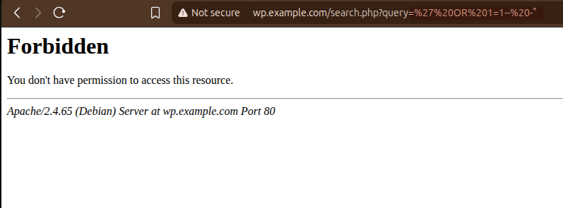

Desde los logs se observa la regla *942100* aplicada y su correspondiente bloqueo.

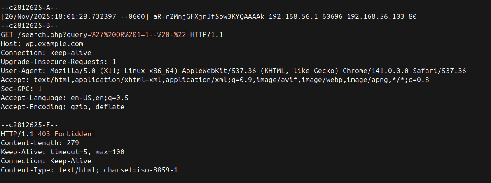

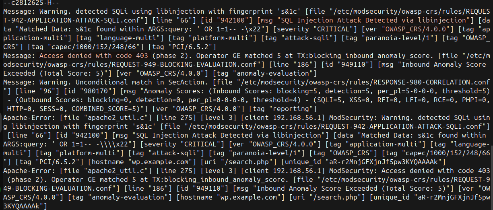

##### Cross-Site Scripting (XSS)

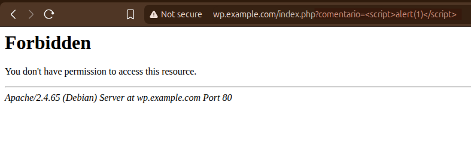

Desde los logs se aprecia la regla *941100* aplicada y su correspondiente bloqueo.

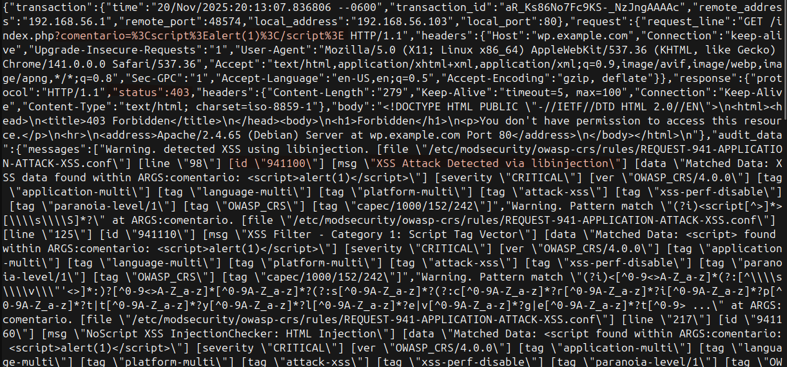

#### Pruebas de Reglas Custom

##### 1- Regla custom 1: Detección de escaneo o fuzzing (User-Agent sospechoso)

Esta regla filtra algunos agentes de usuario sospechosos. Por ejemplo: curl, sqlmap ó nikto, los cuales que veces son el primer paso de reconocimiento en un ataque.

Se ejecuta un curl al sitio y se observa en los logs la regla aplicada:

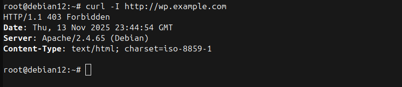

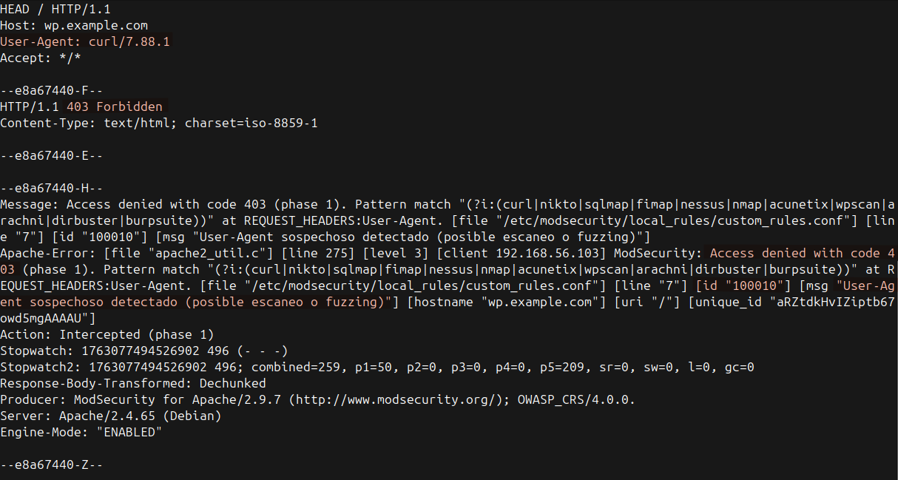

##### 2- Regla custom 2: Protección de rutas críticas o administrativas

Se agregan rutas sensibles para la adminsitración del sistema. La regla bloquea intentos de request desde ips externas a ubicaciones sensibles como "/admin" ó "/controlpanel".

Es necesario configurar un sitio "admin" para relaizar esta prueba.

```bash
# Crear directorio y archivo index
sudo mkdir -p /var/www/html/admin
sudo tee /var/www/html/admin/index.html >/dev/null <<'HTML'
<!doctype html>
<html>
  <head><meta charset="utf-8"><title>Admin - Test</title></head>
  <body>
    <h1>Zona /admin (prueba)</h1>
    <p>Esta es la ruta /admin.</p>
  </body>
</html>
HTML

# Ajustar permisos
sudo chown -R www-data:www-data /var/www/html/admin
sudo chmod -R 0755 /var/www/html/admin

# Recargar Apache
sudo systemctl reload apache2
```

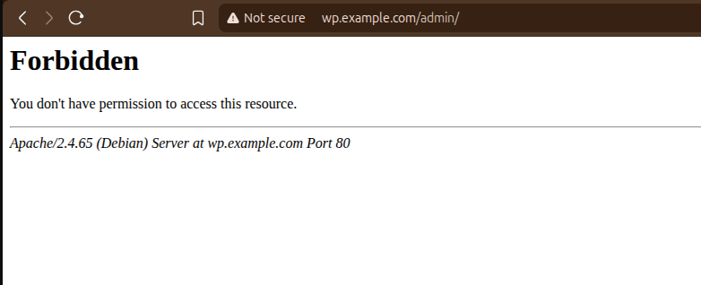

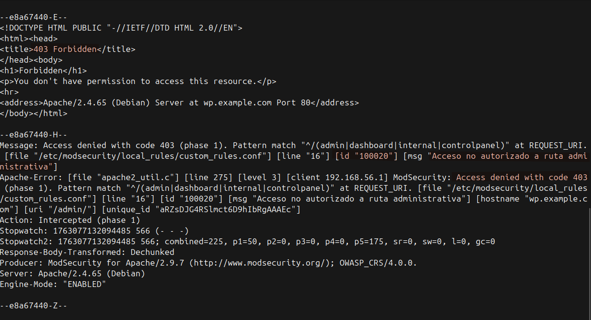

### 5.B Instalacion y configuracíón del API Gateway Kong

Se procederá a la instalacion y configuracion de Kong y luego, utilizando el plugin request-termination. Este ultimo nos permite realizar un login simulado, devolviendo una respuesta fija en JSON.

Se crea un VirtualHost nuevo en Apache: api.example.com

```bash
sudo nano /etc/apache2/sites-available/api.example.com.conf
```

```bash
<VirtualHost *:80>
    ServerName api.example.com

    ProxyPreserveHost On

    # Mandamos TODO a Kong (puerto 8000 en la misma VM)
    ProxyPass        / http://127.0.0.1:8000/
    ProxyPassReverse / http://127.0.0.1:8000/

    ErrorLog ${APACHE_LOG_DIR}/api.example.com-error.log
    CustomLog ${APACHE_LOG_DIR}/api.example.com-access.log combined
</VirtualHost>

```

```bash
sudo a2ensite api.example.com.conf
sudo apachectl configtest
sudo systemctl reload apache2

```

Instalar y configurar API Gateway

```bash
# Instalacion y configuracion de Kong
sudo apt update
sudo apt install -y ca-certificates curl gnupg lsb-release

# Crear directorio para la key
sudo install -m 0755 -d /etc/apt/keyrings

# Descargar la clave GPG oficial
curl -fsSL https://download.docker.com/linux/debian/gpg | \
  sudo gpg --dearmor -o /etc/apt/keyrings/docker.gpg

# Dar permisos de lectura
sudo chmod a+r /etc/apt/keyrings/docker.gpg

echo \
  "deb [arch=$(dpkg --print-architecture) signed-by=/etc/apt/keyrings/docker.gpg] \
  https://download.docker.com/linux/debian \
  $(lsb_release -cs) stable" | \
  sudo tee /etc/apt/sources.list.d/docker.list > /dev/null

sudo apt update

# Instalar docker engine + docker compose
sudo apt install -y docker-ce docker-ce-cli containerd.io docker-buildx-plugin docker-compose-plugin

sudo systemctl enable docker
sudo systemctl start docker
sudo systemctl status docker

# Seguridad: correr docker sin root
sudo usermod -aG docker $USER
newgrp docker
```

```bash
# Levantar Kong
mkdir -p ~/kong-gateway
cd ~/kong-gateway
```

Crear y definir los archivos [docker-compose.yml](api-gateway/docker-compose.yml) y [kong.yml](api-gateway/kong.yml).

```bash
# Luego levantar el servicio de Api Gateway
docker compose up -d
```

#### 5.B.B Pruebas de funcionamiento de API Gateway

El endpoint utilizado para las pruebas fue:
POST http://api.example.com/login

Este endpoint está implementado como un servicio simulado mediante el plugin request-termination, y protegido con:

* API Key Authentication (key-auth)
* Rate Limiting (10 requests/min)
* Validación de método y host
* WAF/ModSecurity en Apache (capa previa a Kong)

##### 1. Prueba de acceso autorizado — API Key válida

Objetivo:

Validar que el API Gateway permite el acceso al endpoint solamente cuando el cliente presenta una API key válida.

Request ejecutada:

```bash
curl -i -X POST http://api.example.com/login \
  -H "Content-Type: application/json" \
  -H "apikey: *****" \
  -d '{"username":"demo-client","password":"***"}'

```

Resultado obtenido (HTTP 200 OK):

* El encabezado X-RateLimit-Remaining-Minute: 9 confirma que la solicitud fue autenticada correctamente.
* El endpoint devuelve el JSON simulado del login.

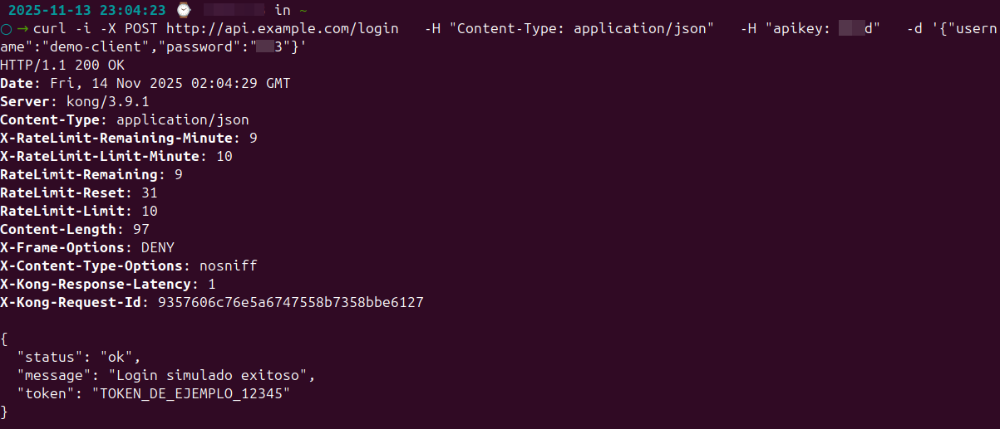

Conclusión:

* El API Gateway permite correctamente el acceso con credenciales válidas.

##### 2. Prueba de acceso SIN API Key — Acceso denegado

Objetivo:

Confirmar que el API Gateway bloquea solicitudes sin API Key (autenticación obligatoria).

Request ejecutada:

```bash
curl -i -X POST http://api.example.com/login \
  -H "Content-Type: application/json" \
  -d '{"username":"demo-client","password":"*****"}'

```

Resultado obtenido (HTTP 401 Unauthorized):

* El encabezado WWW-Authenticate: Key indica el mecanismo requerido.
* El cuerpo de respuesta especifica que no se encontró una API key.

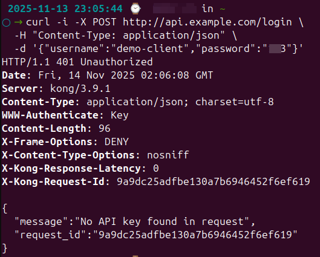

Conclusión:

* El API Gateway impide el acceso cuando la solicitud no contiene la API key requerida.

##### 3. Prueba de Rate Limiting — Exceso de solicitudes

Configuración aplicada:

* Máximo: 10 solicitudes por minuto
* Plugin: rate-limiting (policy: local)

Objetivo:

Verificar que, una vez superado el límite permitido, Kong rechace nuevas solicitudes dentro de la misma ventana temporal.

Request repetida varias veces (mínimo 10):

```bash
curl -i -X POST http://api.example.com/login \
  -H "Content-Type: application/json" \
  -H "apikey: ***" \
  -d '{"username":"demo-client","password":"***"}'

```

Resultado obtenido (HTTP 429 Too Many Requests):

* El encabezado Retry-After: 29 indica cuándo volver a intentar.
* X-RateLimit-Remaining-Minute: 0 indica que el límite fue totalmente consumido.

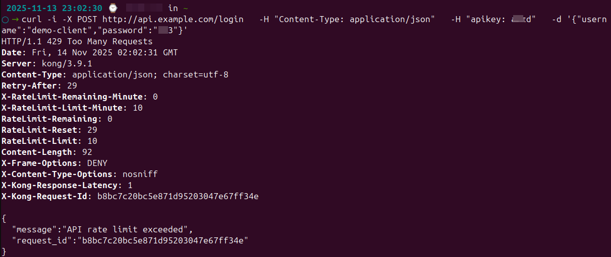

Conclusión:

* El API Gateway aplica correctamente la política de rate-limiting, evitando abusos del endpoint.

Este comportamiento garantiza que el endpoint /login está protegido ante abuso, accesos no autorizados y exceso de peticiones, cumpliendo con las mejores prácticas de seguridad para APIs.

---

## 6. Monitoreo y Respuesta (SIEM)

*Guia detallada de configuracion del servidor con la herramienta Wazuh, para recibir alertas del resto de los servicios de la infraestructura*

### Casos de uso personalizados

#### Caso 1: Viajero Imposible

El caso de uso Impossible Traveller tiene como objetivo detectar inicios de sesión sospechosos en un servicio VPN basándose en la geolocalización de las direcciones IP utilizadas por un mismo usuario.

El sistema registra cada conexión VPN entrante junto con su ubicación estimada (país, ciudad, coordenadas). Cuando un usuario realiza dos conexiones consecutivas desde ubicaciones geográficas incompatibles en el tiempo disponible —por ejemplo, segundos o pocos minutos entre un inicio de sesión desde Uruguay y otro desde Singapur— se considera que el desplazamiento es físicamente imposible.

Este comportamiento suele indicar:

- Uso fraudulento de credenciales
- Secuestro de sesión o robo de cuenta
- Uso compartido de cuentas
- Actividad maliciosa desde IPs anómalas o proxys/VPNS simultáneos

Cuando se detecta una situación de este tipo, el sistema genera una alerta clasificada como Impossible Traveller, con datos enriquecidos de ambas conexiones (tiempos, IPs, países, distancias y ubicación geográfica). Estas alertas permiten a los analistas de seguridad identificar comportamientos anómalos de usuarios y responder rápidamente a potenciales incidentes de seguridad.

##### Ajustes implementados para integrar “Impossible Traveller” en Wazuh

La documentación seguida para implementar el caso de uso se especifica en la sección 14  (Referencias bibliograficas).
Se describen las correcciones y mejoras realizadas sobre la integración Impossible Traveller basada en la guía original publicada en Medium, permitiendo un funcionamiento correcto dentro de Wazuh.

El objetivo de la integración es:

- Registrar la ubicación de cada inicio de sesión VPN por usuario.
- Detectar inicios de sesión sucesivos desde ubicaciones geográficas incompatibles por tiempo/distancia.
- Generar alertas enriquecidas en formato JSON que puedan ser decodificadas por Wazuh.

1. Problemas detectados en la documentación original

* Durante la implementación se identificaron varios problemas en el artículo original que impiden que el sistema funcione correctamente:

- 1.1. Inconsistencia en el location del evento
   En el script original, el evento enviado a Wazuh se generaba con: _1:Imposible_traveler_VPN:{json}_, pero la regla esperaba: _<location>Imposible_traveller_VPN</location>_
- Solución: Unificar todas las referencias a: _Imposible_traveller_VPN_
- 1.2 Colocar el id de regla en ossec.conf: <rule_id>_ID's-VPN-Rules_</rule_id> alli se reemplaza por la/s regla/s que disparan los eventos de conexión VPN. Para este ejemplo se utilizó la rule id _100801_ (Login de usuario exitoso en OpenVPN).
- 1.3. Log enviado a Wazuh en formato dict de Python, no JSON válido. En el script original se envía en el siguiente formato: *{'Event': 'The user...', 'User': 'usuario1', ...}*.
- Solución: Convertir el dict a JSON compacto con:
   json_msg = json.dumps(msg_dict, ensure_ascii=False, separators=(",", ":"))
- 1.4. La regla buscaba un patrón que ya no existía: La regla *555556* buscaba: *"Event ID": "1"*, y en el formato json se ajustaron los espacios.
- Solución: Se corrige en la regla: *<match>"Event ID":"1"</match>*

Corregidos estos pasos, es posible generar la integración descrita en la guía.

Los cambios implementados se visualizan en el script: [custom-imposible_traveller.py](siem/casos_de_uso/viajero_imposible/custom-imposible_traveller.py)

Las reglas y decoders de este caso de uso se pueden encontrar en los siguientes archivos:

- Decoders: [viajero_imposible.xml](siem/decoders/viajero_imposible.xml)
- Reglas: [viajero_imposible.xml](siem/reglas/viajero_imposible.xml)

TODO: faltan capturas de funcionamiento

#### Caso 2: Detección y Bloqueo de Fuerza Bruta sobre SSH

Este caso de uso tiene como objetivo detectar y bloquear intentos de acceso no autorizados al servicio SSH, identificando comportamientos asociados a ataques de fuerza bruta. Se implementan dos reglas complementarias que permiten diferenciar entre intentos con *usuarios inexistentes* e intentos con *usuarios válidos*, incluyendo condiciones de horario para reforzar la detección de actividad anómala.

El mecanismo se basa en la correlación de eventos generados por el agente, aplicando umbrales de frecuencia y ventanas temporales que permiten identificar múltiples intentos fallidos de autenticación en un corto período.

Objetivo

- Detectar intentos reiterados de autenticación fallida en SSH, tanto con usuarios inexistentes como con usuarios legítimos.
- Incrementar el nivel de criticidad cuando los intentos ocurren fuera del horario laboral, lo que aumenta la probabilidad de que la actividad sea maliciosa.
- Facilitar el posterior bloqueo automático o la generación de alertas críticas para el equipo de seguridad.

##### Reglas implementadas

1. Regla 100901 – *Fuerza bruta con usuario inexistente*

   - ID: 100901
   - Nivel: 12
   - Condición: Correlaciona eventos provenientes de la regla base 5710 (intentos fallidos con usuarios no válidos).
   - Frecuencia: 3 intentos fallidos en 60 segundos.
   - Ignorar (cooldown): 120 segundos.
   - Descripción: “Login SSH: Múltiples intentos de login con usuario inexistente”.
   - [MITRE ATT&CK: T1110 – Brute Force](https://attack.mitre.org/techniques/T1110/)

2. Regla 100902 – *Fuerza bruta con usuario existente (fuera de horario)*

   - ID: 100902
   - Nivel: 12
   - Condición: Correlaciona con la regla base 5760 (intentos fallidos con usuarios válidos).
   - Frecuencia: 3 intentos fallidos en 60 segundos.
   - Horario aplicable: Entre 18:00 y 08:30 (fuera de jornada laboral).
   - Ignorar (cooldown): 120 segundos.
   - Descripción: “Login SSH: Múltiples intentos de login con usuario existente (fuera de hora)”
   - MITRE ATT&CK:

      - [T1589 – Gather Victim Identity Information](https://attack.mitre.org/techniques/T1589/)
      - [T1592.004 – Gather Infrastructure Information: Credentials](https://attack.mitre.org/techniques/T1592/004/)
      - [Brute Force](https://attack.mitre.org/techniques/T1110/)

Archivo de reglas: [autenticacion_custom.xml](siem/reglas/autenticacion_custom.xml)

Respuesta Activa

Se configura la respuesta activa por defecto de bloqueo de IP: "firewall-drop".

En el archivo principal de configuracion *ossec.conf* incluir el bloque:

```bash
<!-- Autorizacion bloqueos fuerza bruta -->
  <active-response>
    <disabled>no</disabled>
    <command>firewall-drop</command>
    <location>local</location>
    <rules_id>100901,100902</rules_id>
    <timeout>600</timeout>
  </active-response>
```

Reiniciar el servicio para aplicar los cambios

```bash
systemctl restart wazuh-manager
```

##### Funcionamiento

Intentos de login con usuario "test", inexistente


Regla aplicada y respuesta activa, que se observa mediante la regla 651.


Desde el servidor en cuestion (donde se encuentra instalado el agente), se observa la ip bloqueada en el firewall iptables:


Intentos de login con usuario "rocky" existente


En el timestamp de los eventos se observa la hora que coincide con el rango horario configurado para disparar la regla.

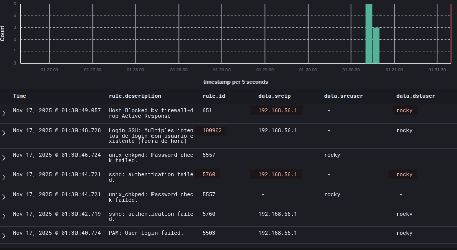

El bloqueo se da de la misma manera.

#### Caso 3

### Alertas del resto de los servicios requeridos

TODO: agregar los logs de modsecurity, openvpn y freeip/Keycloak

---

## 7. Gestion de Identidad y Accesos (IAM)

*Guia detallada de configuracion del servidor de gestion de usuarios Keycloak*

Para demostrar la correcta gestion de usuarios, hemos optado por configurar un servidor Keycloak junto con un servidor web, el cual tendra alojado el servicio de Wordpress, y loguearemos usuarios del servidor Keycloak en dicho portal de Wordpress. Estas autenticaciones de usuarios seran mediante el protocolo OpenIDC y seran enviadas al SIEM al igual que los demas servidores de la infraestructura.

### Instalacion del Keycloak 26.4.5 en un servidor Rocky 9

### Instalacion de Java

sudo dnf install -y java-21-openjdk java-21-openjdk-devel

### Instalacion de Keycloak

sudo mkdir /opt/keycloak
cd /opt/keycloak
sudo dnf install -y wget unzip
sudo wget https://github.com/keycloak/keycloak/releases/download/26.4.5/keycloak-26.4.5.zip
sudo unzip keycloak-26.4.5.zip
cd /opt/keycloak/keycloak-26.4.5

Configuramos el servicio de Keycloak editando el contenido de su archivo de configuracion

sudo nano /etc/systemd/system/keycloak.service

Agregamos los parametros de configuracion al archivo keycloak.service y guardamos los cmabios

[Unit]
Description=Keycloak Server
After=network.target

[Service]
Type=simple
User=keycloak
Group=keycloak
WorkingDirectory=/opt/keycloak
Environment="KEYCLOAK_ADMIN=keycloak"
Environment="KEYCLOAK_ADMIN_PASSWORD=********"
ExecStart=/opt/keycloak/bin/kc.sh start-dev
Restart=on-failure
TimeoutStartSec=600
LimitNOFILE=102642

[Install]
WantedBy=multi-user.target

# Configuramos el firewall del servidor para que acepte conexiones por el puerto 8080

sudo firewall-cmd --add-port=8080/tcp --permanent
sudo firewall-cmd --reload

# Probamos el acceso web al portal de keycloak

http://[IP del servidor]:8080/admin/fosil

ACA FALTA IMAGEN DE PORTAL

---

## 8. Plantilla de Servidor endurecida

*Guia detallada del hardening de un servidor Debian tomando como referencia los CIS CSC Benchmark L1*

El script creado y utilizado para el endurecimiento se puede acceder aqui: [hardening.sh](hardening/hardening.sh)

El script de hardening de este repositorio (hardening.sh) cumple con el fortalecimiento de 4 areas criticas de un servidor Debian teniendo como referencia el CIS CSC Benchmark. Una vez finalizada la ejecucion de los distintos comandos en cada area, se procede a reiniciar los servicios involucrados y configurar la ejecucion de los mismos desde el inicio del sistema operativo.

A nivel de **Firewall local** se configura lo siguiente:

- Instalar el paquete nftables (evolucion del firewall iptables).
- Limpiar reglas de firewall existentes.
- Crear regla "Deny all" por defecto si no hay trafico especifico definido.
- Permitir solamente acceso SSH y puertos del servidor Wazuh (1514 y 1515) en sentido entrante al servidor.
- Permitir conexiones cuyo estado sea "Established" y "Related", vinculadas a sesiones ya iniciadas desde el servidor.
- Permitir trafico saliente irrestricto para asegurar actualizaciones del sistema operativo del servidor.
- Deshabilitar protocolos de red inseguros como DCCP, SCTP, RDS y TIPC bloqueando la carga manual de estos modulos (/bin/true).
- Desinstalar protocolos de red inseguros (DCCP, SCTP, RDS y TIPC) si estuvieran instalados en el servidor.

A nivel de **Auditorioa del sistema** se configura lo siguiente:

- Instalar el paquete de auditoria auditd y sus plugins audispd-plugins.
- Habilitar el servicio de auditoria desde el gestor de arranque GRUB.
- Aplicar reglas de auditoria relativas a cambios de identidad (Usuarios, Grupos y Contrasenias) generando logs ante cualquier cambio.
- Aplicar reglas de auditoria relativas a comandos de privilegio (sudo y su) generando logs ante cualquier uso de los mismos.
- Aplicar reglas de auditoria relativas a la configuracion de red (Hostname, dominio y direccionamiento IP) generando logs con los detalles de cada cambio.
- Configurar politica de retencion de logs de auditoria por tamanio maximo, sin sobreescritura y notificacion via mail al admin si el HDD no tiene espacio fisico.
- Configurar el modo inmutable para todas las reglas de auditoria creadas para impedir su modificacion o borrado intencional.

A nivel de **Acceso administrativo seguro** se configura lo siguiente:

- Deshabilitar el acceso SSH al servidor utilizando el usuario **root**
- Deshabilitar el acceso SSH al servidor utilizando usuario y contrasenia, debiendo utilizarse claves publicas SSH para el acceso seguro.
- Forzar SSH version 2.
- Ignorar archivo de **hosts** y deshabilitar acceso SSH basado en dicho archivo.
- Limitar intentos fallidos de acceso SSH al servidor.
- Configurar timeout de sesiones SSH inactivas.
- Limitar tiempo de login de una sesion SSH.
- Cambiar el nivel de registro de eventos SSH al nivel **Verbose**
- Deshabilitar el reenvio de interfaces graficas a traves de SSH (X11).
- Bloquear variables de entorno personalizadas durante el login SSH.
- Limitar conexiones simultaneas en una sesion SSH para evitar un ataque de denegacion de servicio.
- Deshabilitar reenvios de puertos TCP en una sesion SSH.
- Establecer banner informativo legal que se desplegara por pantalla antes de cada login SSH.

A nivel de **Integracion con el SIEM** se configura lo siguiente:

- Descargar e instalar agente Wazuh en el servidor.
- En la configuracion del agente Wazuh, establecer la direccion IP del Wazuh Manager (SIEM), al cual el agente enviara los logs.

Cabe destacar que antes de aplicar el script de hardening a un servidor Debian con una instalacion limpia, desde cero, el nivel de seguridad CIS CSC segun el agente Wazuh es del 48% y una vez aplicado el script de hardening, dicho nivel de seguridad aciende a 54%. De todos modos, si el lector experimentado decide editar el script de hardening para sumar controles de hardening y asi elevar el nivel de seguridad de un servidor Debian, adjuntamos en este repositorio el documento PDF completo de CIS CSC Benchmark para un servidor Debian 12.

### 8b. Pruebas funcionamiento hardening en SIEM

```bash
# Instalar agente de wazuh para verificar sca antes de hardening
wget https://packages.wazuh.com/4.x/apt/pool/main/w/wazuh-agent/wazuh-agent_4.12.0-1_amd64.deb && sudo WAZUH_MANAGER='ip-manager' dpkg -i ./wazuh-agent_4.12.0-1_amd64.deb

sudo systemctl daemon-reload
sudo systemctl enable wazuh-agent
sudo systemctl start wazuh-agent

# Hardenizar la vm con script del repositorio
apt update
apt install git
git clone https://github.com/PabloRizzo31/obligatorio_seguridadRedesyDatos.git
cd obligatorio_seguridadRedesyDatos/hardening
chmod +x hardening.sh
./hardening.sh

# Chequear nuevamente sca en wazuh
```

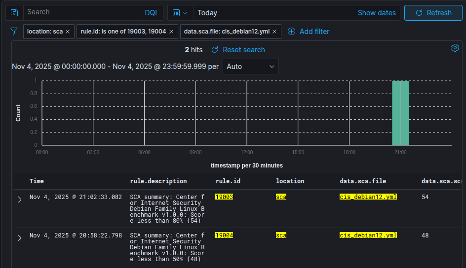

---

## 9. Diagramas de la infraestructura sugerida

*Diagrama de la topologia sugerida*

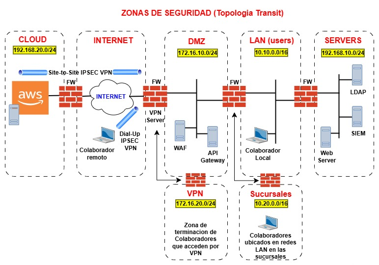

---

## 10. Software necesario para la maqueta virtual

*No se incluye licenciamiento de software dado que se opto por software de licenciamiento libre*

- Distribucion Linux Debian 12
- Distribucion Linux Rocky 9.6
- Wazuh version 4.13.1
- PFsense version 2.8.0
- FreeIPA version 4.12.2
- VirtualBOX version 7.0
- Apache web server version 2.4
- Apache ModSecurity version 2.9
- Kong 3.9.1

---

## 11. Troubleshooting

*Se detallan posibles errores y soluciones que el equipo fue encontrando durante el desarrollo de la solucion*

---

## 12. Capturas de funcionamiento de la maqueta virtual

*En esta seccion se muestran capturas que evidencian el funcionamiento en un entorno virtual*

A continuacion se muestra la validacion del servidor FreeIPA como servidor de autenticacion para el PFsense, desde la web del PFsense

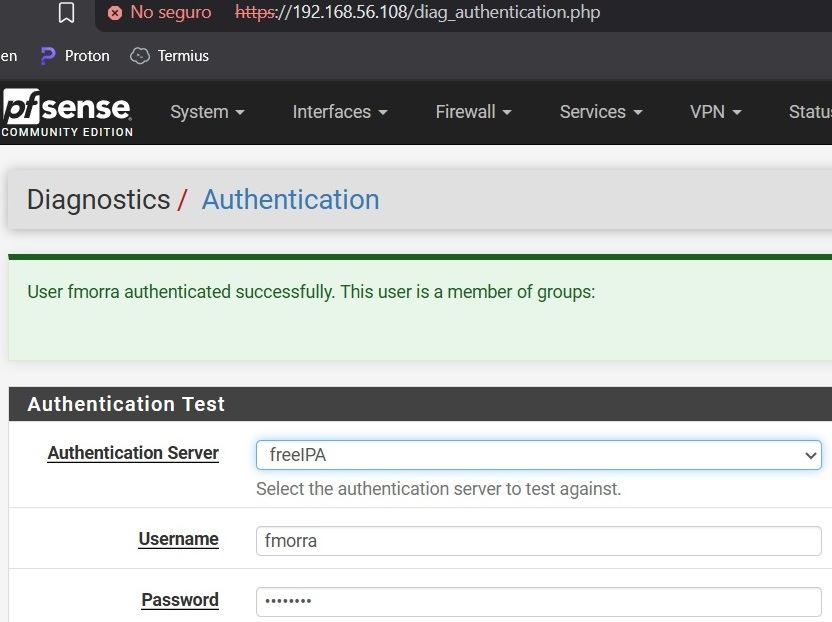

Demostracion del correcto establecimiento del tunel IPsec para la VPN site-to-site entre ambos firewalls PFsense

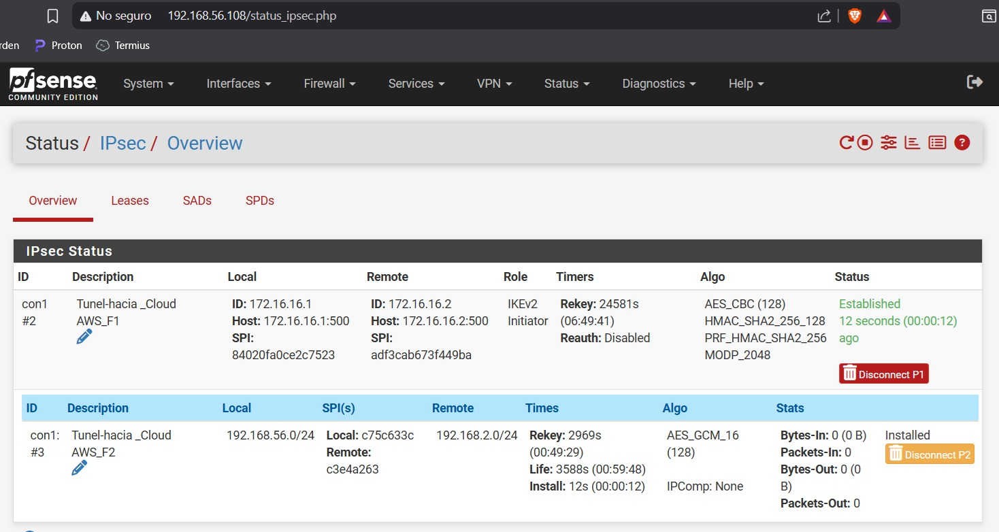


Demostracion de la asignacion de direccion IP de distintos Pools de IP a los colaboradores que se conectan mediante OpenVPN utilizando perfiles VPN distintos.

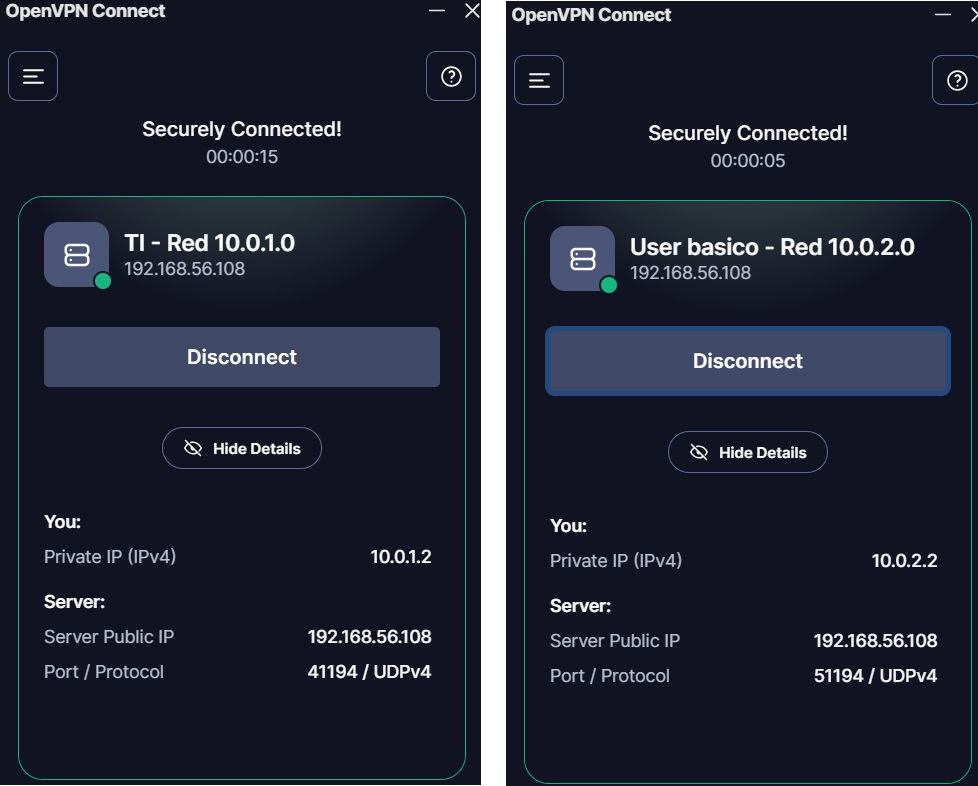

---

## 13. Posibles mejoras de la infraestructura sugerida

*Aqui se detallan posibles mejoras del despliegue que fueron apareciendo durante la creacion del mismo, y que de alguna manera no hubo tiempo para ponerlos en produccion.*

---

## 14. Referencias bibliograficas

- Documentacion del sitio oficial de Debian (https://www.debian.org/doc/)
- Documentacion del sitio oficial de Rocky (https://docs.rockylinux.org/)
- Documentacion del sitio oficial de OpenVPN (https://openvpn.net/community-docs/)
- Documentacion del sitio oficial de PFsense (https://docs.netgate.com/pfsense/)
- Documentacion del sitio oficial de Wazuh (https://documentation.wazuh.com/)
- Wazuh: sintaxis para generar reglas: (https://documentation.wazuh.com/current/user-manual/ruleset/ruleset-xml-syntax/rules.html)
- Wazuh: controles SCA para Hardening: (https://documentation.wazuh.com/current/getting-started/use-cases/configuration-assessment.html)
- Documentacion de Apache ModSecurity (https://www.feistyduck.com/library/modsecurity-handbook-free/online/)
- Repositorio de CRS (Core Ruleset) de OWASP para configuracion de reglas de WAF (https://github.com/coreruleset/coreruleset)
- OWASP TOP 10 2021 (https://owasp.org/Top10/es/)
- Documentacion del sitio oficial de FreeIPA (https://freeipa.org/page/Quick_Start_Guide)
- Material del curso Seguridad en Redes y Dato disponible en la web Aulas de la Facultad ORT (https://aulas.ort.edu.uy)
- Caso de uso Viajero Imposible (https://medium.com/@soc_55904/imposible-traveler-detection-with-wazuh-0b66e45dd9c7)
- Matriz de MITRE ATT&CK (https://attack.mitre.org/)

### Uso de Inteligencia Artificial Generativa

- Prompts puntuales con consultas de errores y troubleshooting de la maqueta en ChatGPT
- --> Error de vinculacion entre PFsense y FeeIPA, error de authenticacion con los formatos de "authentication containers" y "bind credentials"
- -->
- -->
- Prompts de configuracion en Google Gemini
- --> "modificar el script que tenemos hasta el momento para que se ajuste a los controles de cis benchmarks de debian realizados por el modulo sca de wazuh. A continuación te compartimos el script y el archivo de configuracion yml"
